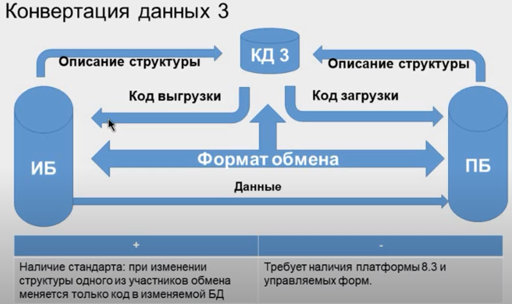

## Регулярный обмен 
1. MD83Exp.epf - Обработка для получения файла описания метаданных. Получаем файлы описания метаданных баз-участников обмена.
2. Определяемся с версией формата обмена. Получаем файлы описания формата обмена (ExchangeMessage, EnterpriseData_1_X) - экcпортируем из "дерево метаданных"-> "Общие" -> "Пакеты XDTO".
3. Загружаем файлы описание метаданных.