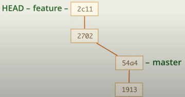

#                   Git курс

## 1. Введение 
   Git - 1. Система контроля версий. 2. Хранилище истории разработки.

--- Установка windows. https://git-scm.com/book/en/v2/Getting-Started-Installing-Git?source=post_page

команда изменения редактора по умолчанию
```
git config --global core.editor \
"'C:/Program Files/Notepad++/notepad++.exe' -multiInst -notabbar -nosession -noPlugin"
```
 __Открыть папку с проектом__ - ПКМ на папке -> *Git bash here*      
 
## 2. Основы
#### 2.1 конфигурации
   - __Создание git-репозитория__ `git init`
   - __Настройка имени__ `git config user.name Badma`
   - __Настройка почты__ `git config user.email Badma@mail.ru`
   - __Просмотр локальных настроек__ `cat .git/config`
   - __Глобальные настройки__ `git config --global user.name Boris`
   - __Вывод всех настроек__ `git config --list`
   - __Вывод только глобальных настроек__ `git config --list --global`
   - __Удаление настройки пользователя__ `git config --unset user.name`
   - __Удаление секции пользователя__ `git config --remove-section user`
   -  __Редакторы:__ https://docs.github.com/en/github/getting-started-with-github/associating-text-editors-with-git
   - __Alias__ 
   - __Вывод команд config__ `git config -h`
   - __Вывод подробности команды__ `git help config`
   ` 
#### 2.2 Создание репозитория
   - __Создание git-репозитория__ `git init`
   - 2-х ступенчатая система хранения: 1) Index; 2) Repository.
   - `git add index.html` файл _index.html_ добавляется в Index
   - `git commit` добавляем в Repository
   - `git status` статус
   - Коммит 1-я строка заголовочная без точки
   - Коммит 2-я строка должна быть пустая
   - Коммит 3-я строка подробности
 
#### 2.3 Права на файлы
   - git сохраняет право только _Есть право исполнять файл_ или _Нет права исполнять файл_
   - create mode 100644 Index.html
   - 100 - файл
   - 644 - _нет права исполнять файл_
   - 755 - _есть право исполнять файл_
   - windows filemode по умолчанию false. 644  

#### 2.4 Автор коммиттер
   - `git commit --author='buda <buda@mail.ru> --date '...'` - поменять автора

#### 2.5 Добавление файлов
   - добавление каталога. в катологе должен быть файл, git не работает с пустыми каталогами. Например помещают файл .gitkeep 
   - `git add.` - передать весь текущий каталог
   - `git reset HEAD dst_katalog` - сбрасывает изменения в индексе для dst_katalog
   - `.gitignore` указываем файлы к-е git будет игнорировать
   - `git add -f dst_katalog/pr.txt` добавляет файл в обход gitignore
   - `git commit -m 'Поправили проблему 34'` коммит без редактора.

#### 2.6 Хороший коммит
    Принцип атомарности и консистентности.

#### 2.7 Индекс
   `git add -p index.html` - добавление с выбором y-да, n - нет

#### 2.8 Коммиты без git add
   - `git commit -a -m`  коммит без редактора и без add
   - `git commit -am`
   - `git commit -all -m` 

#### 2.9 Удаление и переименование файлов
- Глобальный игнор-файл. `git config --global core.excludesFiles ~/.gitignore`
- Удаление файлов. 1) удаляем файл. 2) добавляем в индекс. 3) коммитим
- `git rm <путь>` - удаляет файл и добавляет изменения в индекс 
- `-r` - ключ для удаления папки
- `-f` - позволяет удалить файл с изменениями
- `-- cashed` удаление только из индекса
- Переименование файла git воспринимает как 2 операции удаление файла и добавление нового. 
- `git mv <old> <new> ` - Перименование и добавление в индекс одновременно.

## 3. Ветки    
#### 3.1 Введение
   - Ветки - изолированные потоки разработки 
   - `branch` - ветка, специальная ссылка на коммит. Находятся в файлах .git/refs/heads. некот-е ветки хранятся в др. местах в запакованном виде;
   - `Head` - указатель на текущую ветку. находится в файле .git/head;
   - `2c11.. 2702.. 54a4..` - короткие указатели на коммиты;
   
   
#### 3.2 Создание и переключение
   - `git branch` - просмотр веток;
   - `git branch -v` - просмотр веток с коротким указателем на текущий коммит;
   - `git branch feature` - создание ветки _feature_;
   - `git checkout feature` - переключение на ветку _feature_ ;
   - `git chekcout -b feature` - создание и переключение на ветку _feature_ ;

#### 3.3 Команда checkout незакоммиченных изменениях
   - `git checkout -f` - удалить все изменения. Возврат к состоянию текущий ветки;
   - `git checkout -f feature` - переключиться на ветку feauture c удалением всех не коммиченных изменений;
   - `git stash` собирает не закоммиченные изменения удаляет из файла и архивирует в git;
   - `git stash pop` возвращает изменения. Внимание можно применить и к другой ветке,при этом возможны конфликты, если файл отличается;
   - `` ;
#### 3.4 Перенос незакоммиченных изменений
- `git checkout -b fix` создание ветки _fix_ и переключение HEAD на нее. При переключении все незакоммиченные изменения перенесены в ветку _fix_;
   - `` ;
   - `` ;
   - `` ;
   - `` ;
#### 3.5 Перенос веток в ручную
#### 3.6 Состояние отделенной Head
#### 3.7 Создание и переключение


<details>

  <summary>Spoiler warning</summary>

  

  Spoiler text. Note that it's important to have a space after the summary tag. You should be able to write any markdown you want inside the `<details>` tag... just make sure you close `<details>` afterward.


  ```
  console.log("I'm a code block!");

  ```

  

</details>


```javascript

  console.log("I'm a code block!");

  ```